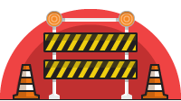

# sbt-blockade



> Defend your builds from bad deps!

[](https://travis-ci.org/Verizon/sbt-blockade)
[](https://maven-badges.herokuapp.com/maven-central/io.verizon.build/sbt-blockade)

## Overview

`sbt-blockade` gives you the ability to restrict which dependencies are tolerated in your builds using plain ol' JSON. Here's an example to whet your your appetite:

```json
{
  "organization": "commons-codec",
  "name": "commons-codec",
  "range": "[1.0,1.6]",
  "expiry": "2017-02-01 11:59:59"
}
```

You can specify whitelisted packages, or blacklisted packages -- or both (see the section *Specifying dependency restrictions* for more info). 

You can restrict packages by version range, and for blacklisted items, you can define a "probationary"/"warning" period that expires after a particular expiry date.

## Getting Started

### Add sbt plugin

First, add the following dependency to your project:

```
addSbtPlugin("io.verizon.build" % "sbt-blockade" % "0.2.+")
```

### Add build settings

The most important setting is the `blockadeUris` sequence:

```
blockadeUris := Seq(new java.net.URI(s"file:///${baseDirectory.value}/blockade.json"))
```

In the above example, *sbt-blockade* will use `blockade.json` from the root of your project directory tree to define your restrictions.
Depending on your organizational needs, this will more likely be a shared location accessible via http.

Note that by default sbt-blockade will NOT fail if it encounters a `java.net.UnknownHostException`.
This allows local compiles to succeed even if the `blockade.json` file is not accessible at all times to the developer's environment (wifi down, vpn down, etc).

### Using sbt-blockade

Once you defined your `blockade.json` as described [below](#specifying-dependency-restrictions), you can have your dependencies validated by running the `blockade` sbt task.

Ideally, you will want to make `compile` depend on `blockade` like the following shows.

```
compile in Compile <<= (compile in Compile).dependsOn(blockade)
```

### sbt-blockade results

sbt-blockade will first check your direct dependencies.
Any direct dependencies in violation of your `blockade.json` will case a build **error** when `blockade` is run.
For instance, if scalaz stream version `7.1.a` is the latest version allowed, trying to depend on `0.8.6` will produce an error:

```
[warn] [test-proj] The following dependencies were caught in the blockade: 
[warn] 	Restricted: org.scalaz.stream:scalaz-stream:0.8.6. Module within the exclusion range ']0.7.3a,)' and expires/expired at 2015-07-29 12:00:00.
java.lang.RuntimeException: One or more of the specified immediate dependencies are restricted.
	at scala.sys.package$.error(package.scala:27)
	at verizon.build.BlockadePlugin$$anonfun$settings$6.apply(plugin.scala:111)
	at verizon.build.BlockadePlugin$$anonfun$settings$6.apply(plugin.scala:88)
	at scala.Function1$$anonfun$compose$1.apply(Function1.scala:47)
	at sbt.$tilde$greater$$anonfun$$u2219$1.apply(TypeFunctions.scala:40)
	at sbt.std.Transform$$anon$4.work(System.scala:63)
	at sbt.Execute$$anonfun$submit$1$$anonfun$apply$1.apply(Execute.scala:226)
	at sbt.Execute$$anonfun$submit$1$$anonfun$apply$1.apply(Execute.scala:226)
	at sbt.ErrorHandling$.wideConvert(ErrorHandling.scala:17)
	at sbt.Execute.work(Execute.scala:235)
	at sbt.Execute$$anonfun$submit$1.apply(Execute.scala:226)
	at sbt.Execute$$anonfun$submit$1.apply(Execute.scala:226)
	at sbt.ConcurrentRestrictions$$anon$4$$anonfun$1.apply(ConcurrentRestrictions.scala:159)
	at sbt.CompletionService$$anon$2.call(CompletionService.scala:28)
	at java.util.concurrent.FutureTask.run(FutureTask.java:266)
	at java.util.concurrent.Executors$RunnableAdapter.call(Executors.java:511)
	at java.util.concurrent.FutureTask.run(FutureTask.java:266)
	at java.util.concurrent.ThreadPoolExecutor.runWorker(ThreadPoolExecutor.java:1142)
	at java.util.concurrent.ThreadPoolExecutor$Worker.run(ThreadPoolExecutor.java:617)
	at java.lang.Thread.run(Thread.java:745)
[error] (*:blockade) One or more of the specified immediate dependencies are restricted.
[error] Total time: 5 s, completed Apr 14, 2017 4:05:46 PM
```

Secondly, sbt-blockade will check your transitive dependencies.
If you instead have scalaz stream `0.8.6` as an _indirect_ dependency (say via http4s), you will get a **warning** and not an error:

```
[info] [test-proj] All direct dependencies are within current restrictions.
[warn] [test-proj]
[warn] com.joescii:test-proj:0.0.1-SNAPSHOT has a restricted transitive dependency: org.scalaz.stream:scalaz-stream:0.8.6
[warn]   Module within the exclusion range ']0.7.3a,)' and expires/expired at 2015-07-29 12:00:00.
[warn] 
[warn] Here is the dependency chain:
[warn]   com.joescii:test-proj:0.0.1-SNAPSHOT
[warn]     org.http4s:http4s-dsl:0.15.8
[warn]       org.http4s:http4s-core:0.15.8
[warn]         org.scalaz.stream:scalaz-stream:0.8.6
[warn] 
[info] Compiling 9 Scala sources to /Users/joescii/code/test-proj/target/scala-2.11/classes...
[success] Total time: 32 s, completed Apr 14, 2017 4:10:12 PM
```

Finally, if you have a direct dependency which is blacklisted with a future expiration date, you will get a build **warning**:

```
[warn] [test-proj] The following dependencies were caught in the blockade: 
[warn] 	Deprecated: org.scalaz.stream:scalaz-stream:0.8.6. Module within the exclusion range ']0.7.3a,)' and expires/expired at 2017-07-29 12:00:00.
[warn] [test-proj]
[warn] com.joescii:test-proj:0.0.1-SNAPSHOT has a restricted transitive dependency: org.scalaz.stream:scalaz-stream:0.8.6
[warn]   Module within the exclusion range ']0.7.3a,)' and expires/expired at 2017-07-29 12:00:00.
[warn] 
[warn] Here is the dependency chain:
[warn]   com.joescii:test-proj:0.0.1-SNAPSHOT
[warn]     intelmedia.ws.common_akka23:s2s:15.0.230
[warn]       oncue.monitoring:core:1.0.9
[warn]         oncue.knobs:core:3.9.16
[warn]           org.scalaz.stream:scalaz-stream:0.8.6
[warn] 
[info] Compiling 9 Scala sources to /Users/joescii/code/test-proj/target/scala-2.11/classes...
[success] Total time: 13 s, completed Apr 14, 2017 4:18:14 PM
```

Note that in both cases where a warning is raised, the build isn't failed and `compile` (etc) will run as usual.

### Specifying dependency restrictions

Both a whitelist and blacklist may be used. 
Ivy version ranges are specified in accordance with [the Ivy version matcher docs](http://ant.apache.org/ivy/history/2.1.0/settings/version-matchers.html).

Dependency restrictions are specified using a JSON object containing a (possibly empty) array of blacklisted items and a (possibly empty) array of whitelisted items. Here's an example:

```json
{
  "whitelist": [
    {
      "organization": "commons-codec",
      "name": "commons-codec",
      "range": "[2.0,3.0["
    }
  ],
  "blacklist": [
    {
      "organization": "commons-codec",
      "name": "commons-codec",
      "range": "[1.0,1.6]",
      "expiry": "2017-02-01 11:59:59"
    },
    {
      "organization": "commons-io",
      "name": "commons-io",
      "range": "(,2.4[",
      "expiry": "2017-02-02 11:59:59"
    },
    {
      "organization": "commons-net",
      "name": "commons-net",
      "range": "(,3.0[",
      "expiry": "2017-02-03 11:59:59"
    },
    {
      "organization": "commons-lang",
      "name": "commons-lang",
      "range": "[1.0,2.3]",
      "expiry": "2017-02-04 11:59:59"
    }
  ]
}
```

Note that a package can be a member of both a whitelist and a blacklist. And a package can be entered more than once (with differing restrictions) on a blacklist. Similarly, a whitelist may have more than one entry for a particular package.

Blacklists have *OR* semantics. In other words, the *union* of blacklist constraints is enforced -- a package meeting *any* blacklist constraint is restricted.

Whitelists have *AND* semantics. A package must meet the *all* whitelist constraints to not be restricted.

#### Blacklist items
Here's an example blacklist item:

```json
{
  "organization": "commons-codec",
  "name": "commons-codec",
  "range": "[1.2.+,)",
  "expiry": "2017-02-01 11:59:59"
}
```
The `range` field is specified using [Ivy Version Matchers](http://ant.apache.org/ivy/history/2.1.0/settings/version-matchers.html).

#### Whitelist items
Whitelist items are similar to blacklist items, except that they are effective immediately, so they have no `expiry` field. Here's an example whitelist item:

```json
{
  "range": "[7.1.0, 7.2.0[",
  "name": "scalaz-core",
  "organization": "org.scalaz"
}

```
The `range` field is specified using [Ivy Version Matchers](http://ant.apache.org/ivy/history/2.1.0/settings/version-matchers.html); here's a generic guideline:

```
Revision  Matches
[1.0,2.0] all versions greater or equal to 1.0 and lower or equal to 2.0
[1.0,2.0[ all versions greater or equal to 1.0 and lower than 2.0
]1.0,2.0] all versions greater than 1.0 and lower or equal to 2.0
]1.0,2.0[ all versions greater than 1.0 and lower than 2.0
[1.0,)  all versions greater or equal to 1.0
]1.0,)  all versions greater than 1.0
(,2.0]  all versions lower or equal to 2.0
(,2.0[  all versions lower than 2.0


Revision  Matches
1.0.+ all revisions starting with '1.0.', like 1.0.1, 1.0.5, 1.0.a
1.1+  all revisions starting with '1.1', like 1.1, 1.1.5, but also 1.10, 1.11
```
